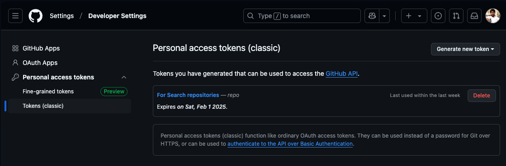

## Scoring-Repositories Project:
This project's source code is based on **Java-21**, it requires Java version 21 to build/run and tested with following tech-stack.

* Java 21.
* Spring-Boot 3.4.1
* Maven
* Mockito and Junit Tests.

## Services Description:
* The project includes the configuration in the `application.properties` file for GitHub API connectivity token which is use to change as required. Make sure the token will be valid for running and testing the application.
* The property name is `github.developer.api.token`, replace its value with desired token.
* The token can be generated from github account, just navigate as follows or see the below screenshot.
User `Profile` -> `Settings` -> `Developer Settings` -> `Personal access tokens` -> `Tokens (classic)` ->from dropdown `Generate new Token`



The **scoring-repositories** project provides implementation for the following end-point(s).

| Method Type | End-point 												 | Description 												 	| 
| :---------- |:-------------------------------------------------------- | :----------------------------------------------------------- |
| `GET`	 	  | **{Server_Address}/v1/repositories/score?{Query_Parameters}**	 |  	The endpoint is use to return the computed popularity score.|


## Getting the Code

To get a local copy of the current code, clone it using git and run it as follows.
```bash
    $ git clone https://github.com/eastechsystem/scoring-repositories.git
    $ cd scoring-repositories
    $ mvn clean spring-boot:run
```

## Additional maven goals to build, test and run this project:
```bash
// 1. To clean project, run below maven command.
$ mvn clean 

// 2. To compile project source code, run below maven command.
$ mvn compile 

// 3. To build project and generate jar/build file, run below maven command.
$ mvn install 

// 4. To run unit test-cases, run below maven command.
$ mvn test 

// 5. To run combined maven goals, use below command.
$ mvn clean install

// 6. To run combined maven goals and skip the unit tests, use below command.
$ mvn clean install -Dmaven.test.skip=true

// 7. To generate test reports , use below command.
$  mvn surefire-report:report

```

## Project documentation:
The project documentation which described the system flow and architecture, is available in this project. 


## Project test report:
The project have implemented several unit and integration tests, is also available in this project.


## Request and Response samples:

### GET Method /v1/repositories/score?{Query_Parameters}:
API End point: http://localhost:8080/v1/repositories/score?createdAfter=2000-01-02&language=Java&page=10&itemsPerPage=3

```bash
Request:
--------
curl -X 'GET' \
  'http://localhost:8080/v1/repositories/score?createdAfter=2000-01-02&language=Java&page=10&itemsPerPage=3' \
  -H 'accept: application/json'
  
Response:
---------
[
    {
        "name": "netty",
        "owner": "netty",
        "stars": 33643,
        "forks": 15988,
        "lastUpdated": "2025-01-05T11:49:29Z",
        "popularityScore": 0.7
    },
    {
        "name": "AndroidUtilCode",
        "owner": "Blankj",
        "stars": 33389,
        "forks": 10694,
        "lastUpdated": "2025-01-05T15:53:45Z",
        "popularityScore": 0.5976430525343255
    },
    {
        "name": "spring-boot-demo",
        "owner": "xkcoding",
        "stars": 33280,
        "forks": 10917,
        "lastUpdated": "2025-01-05T14:56:09Z",
        "popularityScore": 0.600531480298837
    }
]
```
